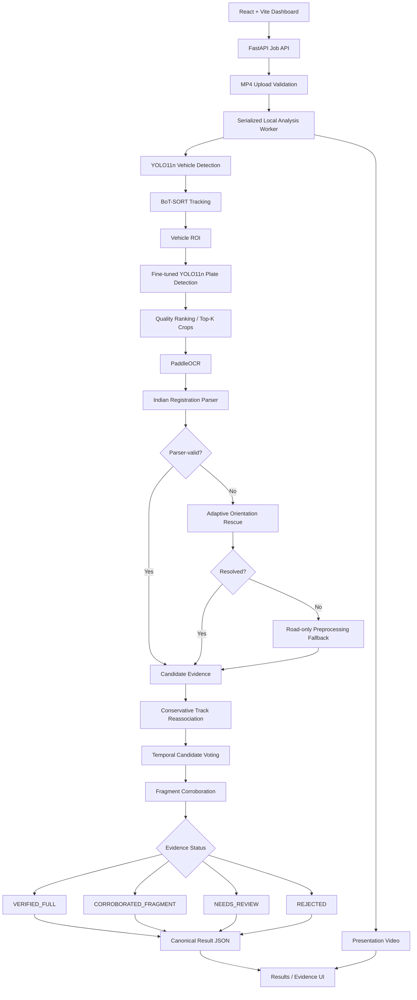
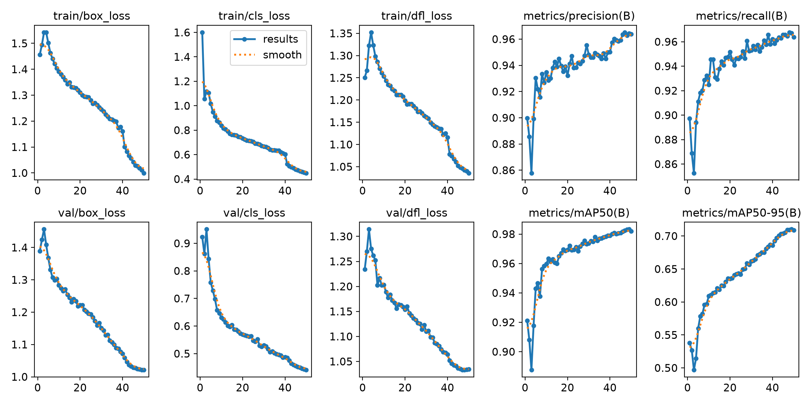
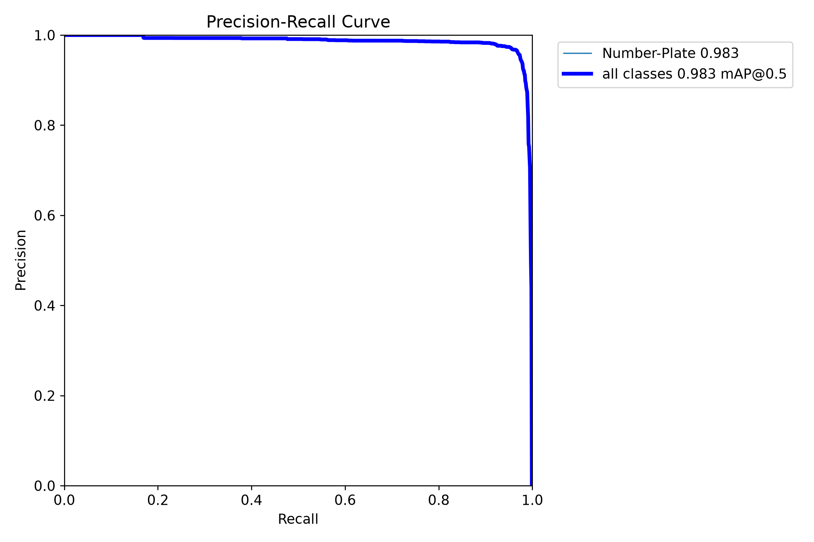
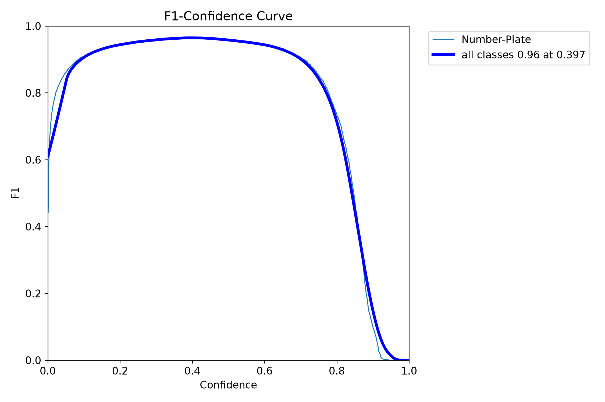
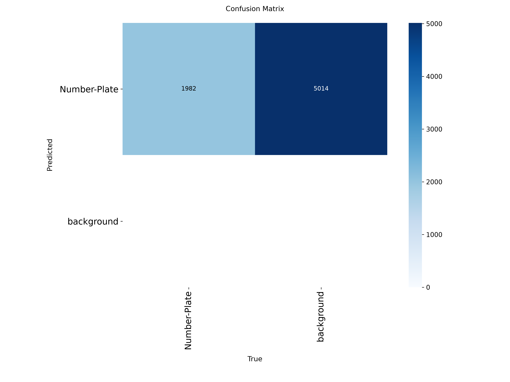

# AutoVue: Deep Learning-Based Indian ANPR Using Vehicle Tracking, OCR, and Multi-Frame Video Analysis

<p align="center">

  <a href="https://github.com/Divya-Sree-R/Autovue/tree/main/src">
    
  </a>

  <a href="https://github.com/Divya-Sree-R/Autovue/blob/main/src/detection/benchmark_detectors.py">
    
  </a>

  <a href="https://docs.ultralytics.com/models/yolo11/">
    
  </a>

  <a href="https://docs.ultralytics.com/modes/track/">
    
  </a>

  <a href="https://github.com/Divya-Sree-R/Autovue/blob/main/outputs/M23_ocr_final/M23C_final_ocr_study.txt">
    
  </a>

  <a href="https://github.com/Divya-Sree-R/Autovue/blob/main/src/tracking/m25b_final_road_tracking.py">
    
  </a>

</p>

**Theme:** Smart Mobility & Intelligent Transportation Systems  
**Domain:** AI/ML — Computer Vision  
**Team:** Glitz — Divya Sree R (IT), Adrina Rayen C (IT)

---

## Overview

**AutoVue** is a research-oriented and locally runnable **Automatic Number Plate Recognition (ANPR)** system for **Indian road video**.

The project combines a leakage-safe computer-vision study with a working end-to-end application. Instead of trusting a single OCR result, AutoVue combines repeated observations of the same vehicle across frames.

```text
Road Video
→ YOLO11n Vehicle Detection
→ BoT-SORT Tracking
→ Vehicle ROI
→ Fine-tuned YOLO11n Plate Detection
→ Quality-Based Top-K Plate Crops
→ PaddleOCR
→ Indian Registration Parsing
→ Adaptive Orientation / Preprocessing Rescue
→ Conservative Track Reassociation
→ Multi-Frame Temporal Consensus
→ Evidence Status
→ Canonical Results + Presentation Video
```

### Current Build Status

> **Demo Ready**

The completed local build includes FastAPI job APIs, a React + Vite dashboard, MP4 upload and validation, serialized analysis jobs, progress tracking, canonical JSON results, presentation-video generation, results/evidence views, recognition diagnostics, completed-job browsing, and safe deletion.

Recognition evidence is reported as:

- `VERIFIED_FULL`
- `CORROBORATED_FRAGMENT`
- `NEEDS_REVIEW`
- `REJECTED`

When no final plate can be selected, the dashboard distinguishes between **No plate detection**, **Plate detected — OCR unresolved**, **OCR read — format unverified**, and **Temporal evidence insufficient**.

## Demo Video

A complete local demo has been recorded as **`AuoVue.mp4`**.

[Watch AutoVue Demo](https://github.com/Divya-Sree-R/Autovue/releases/tag/v0.1.0-demo)

The demo shows video upload, analysis progress, original and processed video playback, recognition results, temporal evidence, recognition diagnostics, and switching between completed analyses.

> The demo video is intentionally kept out of normal Git history because of its file size and will be attached as a GitHub Release asset.

---

## Why This Project?

Indian road-video ANPR is difficult because number plates may be:

- Small or distant,
- Motion-blurred,
- Compressed by video encoding,
- Tilted or perspective-distorted,
- Partially occluded,
- Visible for only a few frames,
- Affected by lighting, glare, stickers, text and background interference,
- Arranged in different one-line or two-line layouts.

A single poor frame can cause a complete identity error.

AutoVue therefore asks:

> **Can multiple imperfect observations from road video be combined to make Indian number-plate recognition more reliable while keeping computation practical?**

---

## Research Foundation

AutoVue is inspired by:

**Xuanhong Wang et al.**  
*License plate recognition system for complex scenarios based on improved YOLOv5s and LPRNet*  
**Scientific Reports (2025)**  
DOI: https://doi.org/10.1038/s41598-025-18311-4

The reference work studies robust LPR using an improved YOLOv5s detector, Triplet Attention, Soft-NMS, a Spatial Transformer Network (STN) and LPRNet.

AutoVue is **not a reproduction** of that paper.

It adapts the research problem toward:

- Indian registration plates,
- Road video,
- Leakage-safe evaluation,
- Controlled detector comparison,
- OCR engine evaluation,
- Indian registration rules,
- Repeated-frame evidence,
- Explicit uncertainty/review states.

---

## System Architecture

AutoVue now has two connected layers:

1. A recognition pipeline, and
2. A local application layer built with FastAPI and React.



The recognition layer is evidence-oriented: OCR output alone is not treated as a verified registration. Parser validity, repeated observations, multi-frame support, and fragment evidence are considered before the final evidence state is assigned.

---

## 1. Dataset and Leakage-Safe Evaluation

### IURS-NPDS

AutoVue uses the **Indian Number Plate Dataset (IURS-NPDS)** for plate detection.

- Total images: **19,309**
- Task: plate **detection**
- Labels: plate bounding boxes
- Images: approximately **640 × 640**
- OCR text transcriptions: **not sufficient for the recognition study**

Dataset citation:

> Talaviya, V., Kathiriya, H., Patel, V., Patel, K., Kevadiya, P., Trivedi, H. (2026).  
> *Indian Number Plate Dataset (IURS) - NPDS*. Mendeley Data, V1.  
> DOI: https://doi.org/10.17632/sxrnr7hwtk.1

### Leakage Audit

The original split contained related source identities across train, validation and test:

| Overlap | Source IDs |
|---|---:|
| Train ∩ Validation | 1,096 |
| Train ∩ Test | 599 |
| Validation ∩ Test | 244 |
| Present in all 3 | 213 |
| Sources appearing in more than one split | 1,513 |

This can make test performance look artificially optimistic.

### Leakage-safe split

| Split | Source IDs | Images |
|---|---:|---:|
| Train | 2,683 | 15,429 |
| Validation | 335 | 1,891 |
| Test | 336 | 1,989 |

**Cross-split source overlap: 0**

All controlled detector comparisons use this corrected split.

---

## 2. Plate Detector Benchmark

| Model | Precision | Recall | F1 | mAP@50 | mAP@50–95 | Inference | Params | Size | Peak VRAM |
|---|---:|---:|---:|---:|---:|---:|---:|---:|---:|
| YOLOv8n | 94.24% | 95.90% | 95.06% | 96.25% | 67.07% | **2.99 ms** | 3.16M | 5.96 MB | **1.32 GB** |
| **YOLO11n** | **95.44%** | 96.21% | **95.82%** | **96.66%** | 69.98% | 3.67 ms | **2.62M** | **5.22 MB** | 1.49 GB |
| YOLO11s | 95.27% | **96.25%** | 95.76% | 96.37% | **70.63%** | 7.38 ms | 9.46M | 18.29 MB | 2.67 GB |

### Selected model: YOLO11n

YOLO11n offered the preferred **accuracy–efficiency trade-off** among the models tested.

YOLO11s improved strict localization by only about **0.65 percentage points mAP@50–95**, but required roughly 3.6× the parameters and around 2× the detector inference time.

> AutoVue does **not** claim that YOLO11n is universally the best detector.

### Main benchmark setup

- 50 epochs
- image size: 640
- batch size: 8
- seed: 42
- pretrained initialization
- GPU: NVIDIA RTX 4050 Laptop GPU
- Ultralytics `optimizer=auto` selected MuSGD (`lr=0.01`, `momentum=0.9`) for the main benchmark

RT-DETR-L was explored as a cross-architecture alternative but was not part of the completed controlled benchmark.

---

### Training Losses and Learning Curves

All YOLO detector experiments were monitored across training and validation using
three primary loss components:

| Loss | Purpose | Interpretation |
|---|---|---|
| **Box Loss** | Measures bounding-box localization error | Lower values indicate better plate localization |
| **Classification Loss** | Measures class prediction error | Lower values indicate more confident/correct class predictions |
| **DFL Loss** | Distribution Focal Loss used for bounding-box regression | Lower values indicate more precise box boundary estimation |

The losses were recorded for every training epoch together with validation
Precision, Recall, mAP@50 and mAP@50–95.

#### YOLO11n Training and Validation Curves

The figure below summarizes the epoch-wise training and validation behaviour,
including Box Loss, Classification Loss, DFL Loss, Precision, Recall,
mAP@50 and mAP@50–95.

<p align="center">
  
</p>

#### YOLO11n Precision–Recall Curve

<p align="center">
  
</p>

#### YOLO11n F1–Confidence Curve

<p align="center">
  
</p>

#### YOLO11n Confusion Matrix

<p align="center">
  
</p>

The loss curves were used to inspect convergence and training behaviour,
while detector selection was based primarily on held-out detection metrics
and computational efficiency rather than training loss alone.

#### Complete Detector Training Evidence

| Model | Training/Loss Curves | Raw Metrics | F1 Curve | PR Curve |
|---|---|---|---|---|
| YOLOv8n | [results.png](./experiments/detector_benchmark/yolov8n/results.png) | [results.csv](./experiments/detector_benchmark/yolov8n/results.csv) | [F1](./experiments/detector_benchmark/yolov8n/BoxF1_curve.png) | [PR](./experiments/detector_benchmark/yolov8n/BoxPR_curve.png) |
| **YOLO11n** | [results.png](./experiments/detector_benchmark/yolo11n/results.png) | [results.csv](./experiments/detector_benchmark/yolo11n/results.csv) | [F1](./experiments/detector_benchmark/yolo11n/BoxF1_curve.png) | [PR](./experiments/detector_benchmark/yolo11n/BoxPR_curve.png) |
| YOLO11s | [results.png](./experiments/detector_benchmark/yolo11s/results.png) | [results.csv](./experiments/detector_benchmark/yolo11s/results.csv) | [F1](./experiments/detector_benchmark/yolo11s/BoxF1_curve.png) | [PR](./experiments/detector_benchmark/yolo11s/BoxPR_curve.png) |

---

## 3. Detector Tuning

Tested input sizes:

```text
640 → 960 → 1280
```

Higher resolution did not provide sufficient benefit, so the final configuration retained:

```text
imgsz = 640
conf  = 0.40
IoU   = 0.70
```

The confidence value was chosen near the validation F1 optimum (~0.4044).

---

## 4. Vehicle-First Detection

AutoVue uses two distinct YOLO11n models:

**Vehicle model**
- Pretrained YOLO11n on COCO
- Not trained by this project
- Car, motorcycle, bus and truck

**Plate model**
- YOLO11n fine-tuned by AutoVue
- Trained on leakage-safe IURS-NPDS

```text
Road Frame
→ Vehicle Detector
→ Vehicle ROI
→ Plate Detector
```

This reduces irrelevant background search and links each plate observation to a tracked vehicle.

This is an engineering design choice, not a controlled proof that vehicle-first detection is always superior.

---

## 5. Tracking and Conservative Reassociation

AutoVue uses **BoT-SORT** through Ultralytics to connect repeated vehicle detections across frames.

Tracking enables multiple plate observations to be grouped for temporal reasoning.

### Track fragmentation

A tracker ID is not guaranteed to equal a physical vehicle identity.

AutoVue therefore applies a conservative reassociation rule:

```text
same frame
+
different tracker IDs
+
byte-identical saved plate crop
=
same conservative cluster
```

No OCR text is used for identity merging.

In the final unseen-video case study:

```text
45 raw tracker IDs
→ 43 conservative clusters
```

These are **conservative clusters**, not 43 confirmed unique vehicles.

---

## 6. Quality-Based Crop Selection

Instead of OCRing every detection, AutoVue ranks crops using approximately:

- 55% detector confidence,
- 25% crop size,
- 10% sharpness,
- 10% contrast.

The pipeline keeps:

```text
Top-K = 5
minimum frame gap = 5
```

These are engineering heuristics rather than globally optimized values.

---

## 7. OCR Study

Because the main dataset is for detection, AutoVue created a separate manually transcribed OCR benchmark.

| Split | Verified readable crops |
|---|---:|
| DEV | 26 |
| TEST | 14 |

TEST was not used for OCR method selection.

### EasyOCR vs PaddleOCR — DEV

| Method | Exact Match | Accuracy | CER |
|---|---:|---:|---:|
| EasyOCR raw | 0 / 26 | 0.00% | 77.43% |
| PaddleOCR raw | 2 / 26 | 7.69% | 67.32% |

**PaddleOCR was selected.**

Frozen OCR models:

```text
PP-OCRv5_server_det
PP-OCRv5_server_rec
```

---

## 8. Indian Registration-Aware Parsing

Simplified supported forms include:

```text
AA00A0000
AA00AA0000
```

Common OCR confusions include:

```text
O ↔ 0
I ↔ 1
B ↔ 8
S ↔ 5
Z ↔ 2
```

### DEV progression

| Stage | Exact | Accuracy | CER |
|---|---:|---:|---:|
| Raw PaddleOCR | 2 / 26 | 7.69% | 67.32% |
| + Indian parser | 6 / 26 | 23.08% | 63.81% |
| + adaptive orientation | 8 / 26 | 30.77% | 53.31% |

Human ground truth is never grammar-corrected. Domain rules apply only to predictions.

---

## 9. Adaptive Orientation and Preprocessing

### Adaptive orientation rescue

AutoVue first tries OCR at `0°`. If unresolved, it tries:

```text
90° / 180° / 270°
```

This avoids unnecessary repeated OCR on already-readable crops.

### Static preprocessing

Tested:

- 3× bicubic upscaling,
- CLAHE,
- Sharpening,
- Otsu thresholding.

On static DEV, generic preprocessing did not improve exact recognition and substantially increased runtime.

**Decision: rejected as the default path.**

### Road-only fallback

For unresolved road crops, preprocessing was reintroduced only as a fallback.

Final unseen-video OCR:

```text
9 parser-valid crops before fallback
+ 6 rescued crops
= 15 parser-valid predictions
```

---

## 10. Real-Road Audit and Domain Shift

The M18 human-reviewed road pilot evaluated 146 sampled frames:

| Metric | Value |
|---|---:|
| Visible real plates | 57 |
| Detector boxes | 27 |
| True positives | 19 |
| False positives | 8 |
| False negatives | 38 |
| Precision | 70.37% |
| Recall | 33.33% |
| F1 | 45.24% |

This exposed a major **domain-shift problem**, especially in recall.

Likely contributors include small plates, motion blur, compression, lighting, camera geometry and occlusion; these causes were not individually isolated experimentally.

---

## 11. Domain Adaptation — Tested and Rejected

A small road-domain fine-tuning experiment used approximately:

```text
12 road frames
14 plate boxes
```

The adapted candidate did not show convincing held-out road improvement and slightly weakened strict source-domain localization.

**Decision: rejected.**

The original leakage-safe YOLO11n remained the selected detector.

---

## 12. Temporal OCR

For multiple complete candidates within a conservative cluster, AutoVue ranks by:

1. More distinct full-support frames,
2. Higher mean OCR confidence,
3. Lower mean grammar correction cost,
4. Higher mean crop quality.

Repeated independent complete evidence is prioritized over one isolated confident observation.

### Fragment corroboration

A fragment may support an existing full candidate, but may never create one.

Frozen rules:

- Complete candidate must already exist,
- Fragment comes from a different frame,
- Longest exact contiguous substring,
- Contains letters and digits,
- Length ≥ 60% of the complete candidate,
- Minimum length = 6.

**Fragments support; they never construct.**

---

## 13. Reliability States

| Status | Meaning |
|---|---|
| **VERIFIED_FULL** | Same complete parser-valid candidate in at least 2 independent frames |
| **CORROBORATED_FRAGMENT** | One complete candidate plus qualifying independent fragment evidence |
| **NEEDS_REVIEW** | Complete candidate exists but lacks independent temporal corroboration |
| **REJECTED** | No complete parser-valid candidate |

These statuses measure **evidence strength**, not correctness.

Only human ground truth can establish whether the final plate is actually correct.

---

## 14. Final Unseen-Road Case Study — M25

A new road video was frozen before inference because earlier videos had already influenced development decisions.

### Input

```text
768 × 432
30 FPS
727 frames
24.23 seconds
```

### Automatic pipeline outcome

| Stage | Result |
|---|---:|
| Selected OCR crops | 92 |
| Raw tracker IDs | 45 |
| Conservative clusters | 43 |
| Parser-valid crop predictions | 15 |
| Clusters with a complete candidate | 8 |
| Unique selected strings | 6 |

### M25E statuses

| Status | Count |
|---|---:|
| VERIFIED_FULL | 2 |
| CORROBORATED_FRAGMENT | 2 |
| NEEDS_REVIEW | 4 |
| REJECTED | 35 |

**No human ground truth was used in M25E**, so these are not accuracy results.

---

## Important: Three Different Evaluation Levels

### 1. Detector performance

Question: *Can YOLO localize plate boxes on the leakage-safe dataset?*

```text
Precision  95.44%
Recall     96.21%
F1         95.82%
mAP@50     96.66%
mAP@50–95  69.98%
```

### 2. Static OCR subsystem

Question: *Given the correct plate crop, can the OCR subsystem read the registration?*

```text
9 / 14 exact
64.29% exact-match accuracy
31.43% CER
122.58 ms mean adaptive latency
```

This is **not end-to-end ANPR accuracy**.

### 3. End-to-end road-video ANPR

Question: *From raw road video, does the complete system return the correct registration?*

**Not yet finally measured.**

This requires M25F human GT and M25G final end-to-end evaluation.

---

## Complete Experimental Evaluation

AutoVue was evaluated at multiple independent levels because detector quality,
OCR quality and complete road-video ANPR quality represent different problems.

### A. Plate Detector — Leakage-Safe NPDS Test

| Model | Precision | Recall | F1 | mAP@50 | mAP@50–95 |
|---|---:|---:|---:|---:|---:|
| YOLOv8n | 94.24% | 95.90% | 95.06% | 96.25% | 67.07% |
| **YOLO11n** | **95.44%** | 96.21% | **95.82%** | **96.66%** | 69.98% |
| YOLO11s | 95.27% | **96.25%** | 95.76% | 96.37% | **70.63%** |

YOLO11n was selected because it provided the preferred balance between
detection quality, parameter count, model size and inference latency.

---

### B. Detector Efficiency

| Model | Inference | Parameters | Model Size | Peak VRAM |
|---|---:|---:|---:|---:|
| YOLOv8n | **2.99 ms** | 3.16M | 5.96 MB | **1.32 GB** |
| **YOLO11n** | 3.67 ms | **2.62M** | **5.22 MB** | 1.49 GB |
| YOLO11s | 7.38 ms | 9.46M | 18.29 MB | 2.67 GB |

---

### C. Real-Road Detector Robustness — M18

Human-reviewed frames: **146**

| Metric | Result |
|---|---:|
| Visible plates | 57 |
| True Positives | 19 |
| False Positives | 8 |
| False Negatives | 38 |
| Precision | 70.37% |
| Recall | 33.33% |
| F1 | 45.24% |

[View M18 evaluation summary](./outputs/M18_real_road_eval/M18C_summary.txt)

This experiment showed that strong leakage-safe dataset metrics did not
automatically translate to strong road-domain recall.

### D. OCR Engine Comparison — DEV

| Method | Exact Match | Accuracy | CER |
|---|---:|---:|---:|
| EasyOCR | 0 / 26 | 0.00% | 77.43% |
| PaddleOCR | 2 / 26 | 7.69% | 67.32% |
| PaddleOCR + Indian Parser | 6 / 26 | 23.08% | 63.81% |
| PaddleOCR + Parser + Orientation Rescue | **8 / 26** | **30.77%** | **53.31%** |

---

### E. Frozen OCR — Held-Out TEST

| Metric | Result |
|---|---:|
| Verified readable crops | 14 |
| Exact matches | 9 / 14 |
| Exact-match accuracy | **64.29%** |
| Character Error Rate | **31.43%** |
| Mean adaptive latency | 122.58 ms |
| Orientation search triggered | 8 / 14 |
| Rotated candidate selected | 3 / 14 |

[View frozen OCR study](./outputs/M23_ocr_final/M23C_final_ocr_study.txt)

> This evaluates OCR using ground-truth plate crops. It is not end-to-end
> Road-video ANPR accuracy.

### F. OCR Ablation / Rejected Methods

| Experiment | Exact Accuracy | CER | Decision |
|---|---:|---:|---|
| Raw PaddleOCR | 7.69% | 67.32% | Baseline |
| + Indian Parser | 23.08% | 63.81% | Keep |
| + Adaptive Orientation | **30.77%** | **53.31%** | Keep |
| Generic Static Preprocessing | 23.08% | 63.81% | Reject as default |
| Spatial-Order Rescue | 23.08% | 63.81% | Reject |

Generic static preprocessing also increased mean latency to approximately
**250.91 ms** without increasing exact DEV recognition.

### G. Frozen Unseen-Road Pipeline — M25

| Stage | Result |
|---|---:|
| Video frames | 727 |
| Raw tracker IDs with plate candidates | 45 |
| Selected OCR crops | 92 |
| Conservative clusters | 43 |
| Parser-valid crop predictions | 15 |
| Clusters with complete candidates | 8 |
| Unique selected strings | 6 |

#### Temporal Evidence Results

| Status | Clusters |
|---|---:|
| VERIFIED_FULL | 2 |
| CORROBORATED_FRAGMENT | 2 |
| NEEDS_REVIEW | 4 |
| REJECTED | 35 |

[View M25 temporal-consensus results](./outputs/M25_final_road_eval/M25E_temporal_consensus_summary.txt)

> These are evidence-strength outcomes, not final correctness/accuracy labels.
> M25F human ground truth and M25G end-to-end evaluation remain pending.

---

## Technology Decisions

| Layer | Selected | Alternatives | Reason |
|---|---|---|---|
| Core language | Python | C++, Java, Node.js | Strongest integration with the project AI stack |
| DL runtime | PyTorch | TensorFlow | Foundation of the Ultralytics workflow used |
| Vehicle detector | Pretrained YOLO11n | Custom detector | COCO vehicle classes already available |
| Plate detector | Fine-tuned YOLO11n | YOLOv8n, YOLO11s, RT-DETR, Faster R-CNN, SSD | Selected by controlled project benchmark |
| Tracking | BoT-SORT | SORT, DeepSORT, ByteTrack, OC-SORT | Integrated engineering choice; no tracker benchmark |
| OCR | PaddleOCR | EasyOCR, Tesseract, LPRNet, CRNN, TrOCR/PARSeq | PaddleOCR beat EasyOCR on DEV |
| Image operations | OpenCV | Learned enhancement | Deterministic and auditable |
| Temporal fusion | Rule-based consensus | HMM/CRF, LSTM, Transformer | Small labelled road set + interpretability |
| API | FastAPI *(planned)* | Flask, Django, Node/Express | Python-native inference API |
| UI | React *(planned)* | Streamlit, Next.js | Polished evidence/review interface |

Untested alternatives are not claimed to be inferior.

---

## Repository Structure

```text
IndianANPR/
├── data/
│   ├── raw/                         # local / ignored
│   └── processed/                   # local / ignored
├── experiments/
│   ├── plate_detector/
│   ├── detector_benchmark/
│   └── domain_adaptation/
├── outputs/
│   ├── M01_environment/
│   ├── ...
│   ├── M18_real_road_eval/
│   ├── M20_ocr_dataset/
│   ├── M21_ocr_benchmark/
│   ├── M23_ocr_final/
│   ├── M24_temporal_ocr/
│   └── M25_final_road_eval/
├── src/
│   ├── detection/
│   ├── tracking/
│   ├── recognition/
│   └── ocr/
├── .gitignore
└── README.md
```

Large artifacts such as raw datasets, videos, virtual environments and `.pt` weights are intentionally excluded from Git.

---

## Environment

Development/testing environment:

```text
OS          : WSL2 Ubuntu 24.04
Python      : 3.12
GPU         : NVIDIA RTX 4050 Laptop GPU (6 GB)
Ultralytics : 8.4.173
PaddleOCR   : 3.7.0
Paddle      : 3.2.1 GPU
```

The project uses a separate PaddleOCR environment because the Paddle and PyTorch/Ultralytics stacks have different dependency requirements.

> Experiment manifests and `args.yaml` files remain the source of truth for reproducing completed training runs.

---

## Dataset Setup

The raw dataset is not stored in Git.

1. Download IURS-NPDS from: https://doi.org/10.17632/sxrnr7hwtk.1
2. Place it under the local `data/` workspace.
3. Run the preparation and leakage-analysis scripts under `src/detection/`.
4. Build the source-level leakage-safe split before reproducing detector experiments.

Do not use the original leaking split for final research claims.

---

## Running AutoVue Locally

AutoVue runs locally with a separate FastAPI backend and React + Vite frontend.

### 1. Start the backend

From the project root:

```bash
cd ~/projects/IndianANPR
source .venv/bin/activate

export PYTHONPATH=src:.

uvicorn app.backend.main:app \
  --host 127.0.0.1 \
  --port 8000
```

Verify the API:

```bash
curl http://127.0.0.1:8000/health
```

Expected response:

```json
{"status":"ok","service":"AutoVue API","version":"0.1.0"}
```

### 2. Start the frontend

Open a second terminal:

```bash
cd ~/projects/IndianANPR/app/frontend

export NVM_DIR="$HOME/.nvm"
[ -s "$NVM_DIR/nvm.sh" ] && . "$NVM_DIR/nvm.sh"

nvm use 22

npm run dev -- \
  --host 127.0.0.1 \
  --port 5173
```

Open:

```text
http://localhost:5173
```

### 3. Analysis workflow

```text
Upload MP4
→ Validate input
→ Create job
→ Start analysis
→ Vehicle detection + tracking
→ Plate crop selection
→ PaddleOCR + Indian parsing
→ Temporal consensus
→ Canonical JSON result
→ Presentation video
→ Dashboard review
```

### Note on PaddleOCR

The OCR stage uses the separate AutoVue PaddleOCR environment configured by the project worker. The normal product workflow is started from the main `.venv` environment.

### Important worker note

Do not restart the FastAPI process while an analysis job is running.

The current analysis worker runs inside the FastAPI process, so an API restart can interrupt an active job.

---

## Research Milestones

| Stage | Outcome |
|---|---|
| M01–M13 | Baseline environment, vehicle/plate pipeline, tracking and early OCR |
| M14 / M14B | Source-level leakage discovered and corrected |
| M15–M17 | Controlled detector benchmark and YOLO11n selection |
| M18 | Human-reviewed real-road detector robustness audit |
| M19 | Small domain-adaptation experiment tested and rejected |
| M20–M23 | OCR ground truth, OCR comparison, parser/orientation studies and frozen OCR test |
| M24 | Temporal OCR, road fallback, fragment corroboration and reassociation |
| M25A–M25E | Frozen unseen-road automatic case study |
| **M26** | **FastAPI + React local application, job workflow, presentation video, recognition observability, upload hardening, profiling and final smoke testing** |

---

## Current Status

### Completed

The current AutoVue implementation includes:

- Leakage-safe IURS-NPDS dataset splitting,
- Controlled YOLOv8n / YOLO11n / YOLO11s detector benchmarking,
- YOLO11n selection for the final plate detector,
- Validation-based operating point selection,
- Vehicle-first detection,
- BoT-SORT vehicle tracking,
- Quality-based plate-crop selection,
- EasyOCR vs PaddleOCR evaluation,
- PaddleOCR selection,
- Indian registration-aware parsing,
- Adaptive orientation rescue,
- Road-only preprocessing fallback,
- Conservative track reassociation,
- Multi-frame temporal candidate voting,
- Fragment corroboration,
- Evidence-strength classification,
- Frozen unseen-road case study,
- FastAPI application backend,
- React + Vite dashboard,
- MP4 video upload and validation,
- Serialized local analysis jobs,
- Pipeline progress and stage reporting,
- Canonical JSON results,
- Presentation-video generation,
- Original and processed video review,
- Results and Evidence views,
- Completed-job selection and deletion,
- Recognition-result loading states,
- Recognition failure-stage diagnostics,
- Empty video rejection,
- Corrupt MP4 rejection,
- 500 MB upload limit,
- Failed-upload workspace cleanup,
- Duplicate final-video rendering removal,
- Local performance profiling,
- Final local browser smoke testing.

### Local Demo Status

The current build has been validated locally with multiple road videos.

The final smoke test confirmed:

```text
Frontend                → Online
FastAPI API            → Online
Video upload          → Working
Analysis jobs          → Working
Results API            -> Working
Presentation video    → Working
Recognition results   → Working
Evidence states      → Working
Job switching         -> Working
Invalid upload handling -> Working
```

The current stable version is treated as **AutoVue Local Demo Build**.

### Evaluation Boundary

The detector benchmark and static OCR evaluation are completed and reported separately.

The road-video evidence states are **system outputs** and must not be interpreted as ground-truth accuracy.

A full human-annotated road-video ground-truth evaluation is still required before reporting a final end-to-end ANPR accuracy.

---

## Research Contribution

AutoVue does not claim to invent YOLO, BoT-SORT or PaddleOCR.

Its contribution is the **system design and experimental methodology**, including:

1. Source-level leakage discovery and correction,
2. Controlled detector selection using accuracy and efficiency,
3. Real-road generalization auditing,
4. Hybrid OCR + Indian registration knowledge,
5. Adaptive orientation rescue,
6. Conditional road-only preprocessing,
7. Quality-aware multi-frame crop selection,
8. Deterministic temporal voting,
9. Safe fragment corroboration,
10. Conservative reassociation without OCR identity merging,
11. Explicit evidence-strength states,
12. Frozen unseen-road reproducibility.

---

## Limitations

- Final human GT for the unseen-road video is pending,
- End-to-end road ANPR accuracy is not yet established,
- M19 used very little labelled road data,
- Real-road detector recall remains a concern,
- Static OCR TEST contains only 14 verified readable crops,
- Parser coverage is simplified rather than exhaustive,
- Conservative reassociation intentionally misses some possible merges,
- Clusters are not guaranteed unique physical vehicles,
- Alternative trackers were not benchmarked,
- The current analysis worker runs inside the FastAPI process, so restarting the API during an active job can interrupt that job.

---

## Interpretation and Scope of Reported Results

The reported metrics in AutoVue correspond to different stages of the pipeline and should be interpreted within their respective evaluation settings.

- **Detector comparison:** YOLO11n was selected because it provided the preferred accuracy–efficiency trade-off among the models evaluated under the same leakage-safe benchmark. This does not imply universal superiority over all object detectors.

- **Static OCR evaluation:** The reported **64.29% exact-match accuracy** was obtained on **14 held-out ground-truth plate crops** using the frozen OCR pipeline. This value represents OCR subsystem performance and should not be interpreted as complete end-to-end ANPR accuracy.

- **Temporal evidence status:** `VERIFIED_FULL` indicates that the same complete parser-valid plate candidate was observed in at least two independent frames. It represents stronger temporal evidence, but does not by itself guarantee ground-truth correctness.

- **Track clustering:** The **43 clusters** produced during M25 are conservative track clusters created from tracker outputs. They should not be interpreted as 43 confirmed unique physical vehicles.

- **Domain adaptation experiment:** The tested small-scale road-domain adaptation experiment did not demonstrate convincing improvement and was therefore not retained in the final detector configuration.

Final end-to-end road-video ANPR accuracy will be reported only after the planned human ground-truth annotation and M25G evaluation.

---

## Local Application Layer

The product layer described here is implemented and working locally.

### Backend — FastAPI

FastAPI exposes the AutoVue workflow through endpoints for:

- Uploading MP4 videos,
- Listing analysis jobs,
- Retrieving a job,
- Starting analysis,
- Retrieving canonical results,
- Accessing generated media,
- Deleting completed jobs.

Each product job is stored in its own workspace under:

```text
app_data/jobs/<job_id>/
```

A job manifest tracks fields such as:

```text
job_id
status
progress
message
original_filename
size_bytes
created_at
updated_at
error
```

The current job states are:

```text
UPLOADED
QUEUED
DETECTING_TRACKING
OCR_PROCESSING
TEMPORAL_CONSENSUS
RENDERING
COMPLETED
FAILED
```

### Frontend — React + Vite

The current dashboard provides:

```text
Overview
Analyze
Results
Evidence
Analytics
System
```

The Analyze workspace supports video upload, job selection,
pipeline progress, original footage, AutoVue presentation video,
recognition results and evidence review.

### Recognition observability

When a valid final plate cannot be produced, AutoVue does not
invent a registration number.

The dashboard distinguishes between:

```text
No plate detection
Plate detected — OCR unresolved
OCR read — format unverified
Temporal evidence insufficient
```

This makes localization, OCR, parser and temporal-evidence
failure modes visible to the user.

### Upload validation

The upload endpoint:

- Accepts MP4 input,
- Enforces a 500 MB upload limit,
- Rejects empty videos,
- Verifies that the MP4 can be opened,
- Verifies that at least one frame can be decoded,
- Removes the temporary job workspace when validation fails.

### Generated outputs

A successful analysis can produce artifacts such as:

```text
canonical_result.json
metadata/
crops/
video/tracking.mp4
video/presentation.mp4
logs/analysis.log
```

The dashboard consumes the canonical result and presentation
video rather than recomputing recognition in the browser.

### Performance work

Profiling showed that plate detection inside vehicle ROIs is the
largest tracking-stage compute cost in the current pipeline.

A multi-ROI batching experiment improved runtime, but changed
downstream crops and recognized candidates. Because correctness
could not be established without ground truth, that optimization
was deliberately not adopted.

A safe optimization was retained instead: AutoVue no longer
encodes an unnecessary duplicate final analyzed video.

### Current worker limitation

Analysis currently runs in an in-process background worker tied
to the FastAPI process.

The API process should therefore not be restarted while an
analysis job is running.

This limitation does not affect the current local demo workflow,
but the present implementation is not claimed to be a
production-grade distributed job system.

---

## References

1. X. Wang et al., **“License plate recognition system for complex scenarios based on improved YOLOv5s and LPRNet,”** *Scientific Reports*, 2025.  
   https://doi.org/10.1038/s41598-025-18311-4

2. N. Aharon, R. Orfaig, B.-Z. Bobrovsky, **“BoT-SORT: Robust Associations Multi-Pedestrian Tracking.”**  
   https://arxiv.org/abs/2206.14651

3. **Ultralytics YOLO11 Documentation**  
   https://docs.ultralytics.com/models/yolo11/

4. **Ultralytics Tracking Documentation**  
   https://docs.ultralytics.com/modes/track/

5. **PaddleOCR / PP-OCRv5 Documentation**  
   https://www.paddleocr.ai/

6. V. Talaviya et al., **“Indian Number Plate Dataset (IURS) - NPDS,”** Mendeley Data, V1, 2026.  
   https://doi.org/10.17632/sxrnr7hwtk.1

---

## Authors

**Team Glitz**

- Divya Sree R — Information Technology
- Adrina Rayen C — Information Technology

---

> **AutoVue's goal is not just to read a number plate. It is to show how much evidence supports the reading, where uncertainty remains, and when a human should review the result.**
