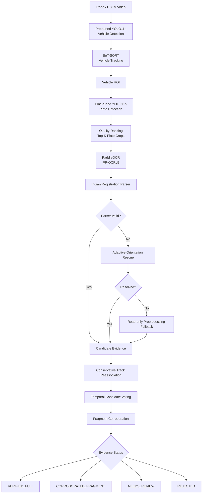
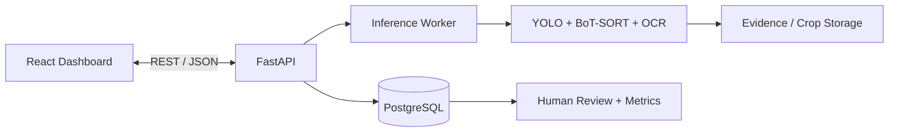

# AutoVue: Deep Learning-Based Indian ANPR Using Vehicle Tracking, OCR, and Multi-Frame Video Analysis

<p align="center"><b>Leakage-safe detection · Multi-frame OCR · Evidence-aware recognition</b></p>

<p align="center">
  
  
  
  
</p>

**Theme:** Smart Mobility & Intelligent Transportation Systems  
**Domain:** AI/ML — Computer Vision  
**Team:** Glitz — Divya Sree R (IT), Adrina Rayen C (IT)

---

## Overview

**AutoVue** is a research-oriented Automatic Number Plate Recognition (ANPR) system for **Indian road video**.

Instead of trusting a single detector/OCR result, AutoVue treats video as a sequence of repeated observations of the same vehicle and combines evidence across frames.

A typical single-frame pipeline is fragile:

```text
Camera → Plate Detector → OCR → Result
```

AutoVue uses a reliability-aware pipeline:

```text
Road Video
→ Vehicle Detection
→ Vehicle Tracking
→ Vehicle ROI
→ Plate Detection
→ Quality-Based Crop Selection
→ OCR
→ Indian Registration Parsing
→ Adaptive Rescue
→ Conservative Track Reassociation
→ Temporal Consensus
→ Reliability Status
```

The goal is not only to produce a plate string, but also to indicate **how strongly the available video evidence supports that result**.

---

## Why This Project?

Indian road-video ANPR is difficult because number plates may be:

- small or distant,
- motion-blurred,
- compressed by video encoding,
- tilted or perspective-distorted,
- partially occluded,
- visible for only a few frames,
- affected by lighting, glare, stickers, text and background interference,
- arranged in different one-line or two-line layouts.

A single poor frame can cause a complete identity error.

AutoVue therefore asks:

> **Can multiple imperfect observations from road video be combined to make Indian number-plate recognition more reliable while keeping computation practical?**

---

## Research Foundation

AutoVue is inspired by:

**Xuanhong Wang et al.**  
*License plate recognition system for complex scenarios based on improved YOLOv5s and LPRNet*  
**Scientific Reports (2025)**  
DOI: https://doi.org/10.1038/s41598-025-18311-4

The reference work studies robust LPR using an improved YOLOv5s detector, Triplet Attention, Soft-NMS, a Spatial Transformer Network (STN) and LPRNet.

AutoVue is **not a reproduction** of that paper.

It adapts the research problem toward:

- Indian registration plates,
- road video,
- leakage-safe evaluation,
- controlled detector comparison,
- OCR engine evaluation,
- Indian registration rules,
- repeated-frame evidence,
- explicit uncertainty/review states.

---

## System Architecture



---

## 1. Dataset and Leakage-Safe Evaluation

### IURS-NPDS

AutoVue uses the **Indian Number Plate Dataset (IURS-NPDS)** for plate detection.

- Total images: **19,309**
- Task: plate **detection**
- Labels: plate bounding boxes
- Images: approximately **640 × 640**
- OCR text transcriptions: **not sufficient for the recognition study**

Dataset citation:

> Talaviya, V., Kathiriya, H., Patel, V., Patel, K., Kevadiya, P., Trivedi, H. (2026).  
> *Indian Number Plate Dataset (IURS) - NPDS*. Mendeley Data, V1.  
> DOI: https://doi.org/10.17632/sxrnr7hwtk.1

### Leakage Audit

The original split contained related source identities across train, validation and test:

| Overlap | Source IDs |
|---|---:|
| Train ∩ Validation | 1,096 |
| Train ∩ Test | 599 |
| Validation ∩ Test | 244 |
| Present in all 3 | 213 |
| Sources appearing in more than one split | 1,513 |

This can make test performance look artificially optimistic.

### Leakage-safe split

| Split | Source IDs | Images |
|---|---:|---:|
| Train | 2,683 | 15,429 |
| Validation | 335 | 1,891 |
| Test | 336 | 1,989 |

**Cross-split source overlap: 0**

All controlled detector comparisons use this corrected split.

---

## 2. Plate Detector Benchmark

| Model | Precision | Recall | F1 | mAP@50 | mAP@50–95 | Inference | Params | Size | Peak VRAM |
|---|---:|---:|---:|---:|---:|---:|---:|---:|---:|
| YOLOv8n | 94.24% | 95.90% | 95.06% | 96.25% | 67.07% | **2.99 ms** | 3.16M | 5.96 MB | **1.32 GB** |
| **YOLO11n** | **95.44%** | 96.21% | **95.82%** | **96.66%** | 69.98% | 3.67 ms | **2.62M** | **5.22 MB** | 1.49 GB |
| YOLO11s | 95.27% | **96.25%** | 95.76% | 96.37% | **70.63%** | 7.38 ms | 9.46M | 18.29 MB | 2.67 GB |

### Selected model: YOLO11n

YOLO11n offered the preferred **accuracy–efficiency trade-off** among the models tested.

YOLO11s improved strict localization by only about **0.65 percentage points mAP@50–95**, but required roughly 3.6× the parameters and around 2× the detector inference time.

> AutoVue does **not** claim that YOLO11n is universally the best detector.

### Main benchmark setup

- 50 epochs
- image size: 640
- batch size: 8
- seed: 42
- pretrained initialization
- GPU: NVIDIA RTX 4050 Laptop GPU
- Ultralytics `optimizer=auto` selected MuSGD (`lr=0.01`, `momentum=0.9`) for the main benchmark

RT-DETR-L was explored as a cross-architecture alternative but was not part of the completed controlled benchmark.

---

## 3. Detector Tuning

Tested input sizes:

```text
640 → 960 → 1280
```

Higher resolution did not provide sufficient benefit, so the final configuration retained:

```text
imgsz = 640
conf  = 0.40
IoU   = 0.70
```

The confidence value was chosen near the validation F1 optimum (~0.4044).

---

## 4. Vehicle-First Detection

AutoVue uses two distinct YOLO11n models:

**Vehicle model**
- pretrained YOLO11n on COCO
- not trained by this project
- car, motorcycle, bus and truck

**Plate model**
- YOLO11n fine-tuned by AutoVue
- trained on leakage-safe IURS-NPDS

```text
Road Frame
→ Vehicle Detector
→ Vehicle ROI
→ Plate Detector
```

This reduces irrelevant background search and links each plate observation to a tracked vehicle.

This is an engineering design choice, not a controlled proof that vehicle-first detection is always superior.

---

## 5. Tracking and Conservative Reassociation

AutoVue uses **BoT-SORT** through Ultralytics to connect repeated vehicle detections across frames.

Tracking enables multiple plate observations to be grouped for temporal reasoning.

### Track fragmentation

A tracker ID is not guaranteed to equal a physical vehicle identity.

AutoVue therefore applies a conservative reassociation rule:

```text
same frame
+
different tracker IDs
+
byte-identical saved plate crop
=
same conservative cluster
```

No OCR text is used for identity merging.

In the final unseen-video case study:

```text
45 raw tracker IDs
→ 43 conservative clusters
```

These are **conservative clusters**, not 43 confirmed unique vehicles.

---

## 6. Quality-Based Crop Selection

Instead of OCRing every detection, AutoVue ranks crops using approximately:

- 55% detector confidence,
- 25% crop size,
- 10% sharpness,
- 10% contrast.

The pipeline keeps:

```text
Top-K = 5
minimum frame gap = 5
```

These are engineering heuristics rather than globally optimized values.

---

## 7. OCR Study

Because the main dataset is for detection, AutoVue created a separate manually transcribed OCR benchmark.

| Split | Verified readable crops |
|---|---:|
| DEV | 26 |
| TEST | 14 |

TEST was not used for OCR method selection.

### EasyOCR vs PaddleOCR — DEV

| Method | Exact Match | Accuracy | CER |
|---|---:|---:|---:|
| EasyOCR raw | 0 / 26 | 0.00% | 77.43% |
| PaddleOCR raw | 2 / 26 | 7.69% | 67.32% |

**PaddleOCR was selected.**

Frozen OCR models:

```text
PP-OCRv5_server_det
PP-OCRv5_server_rec
```

---

## 8. Indian Registration-Aware Parsing

Simplified supported forms include:

```text
AA00A0000
AA00AA0000
```

Common OCR confusions include:

```text
O ↔ 0
I ↔ 1
B ↔ 8
S ↔ 5
Z ↔ 2
```

### DEV progression

| Stage | Exact | Accuracy | CER |
|---|---:|---:|---:|
| Raw PaddleOCR | 2 / 26 | 7.69% | 67.32% |
| + Indian parser | 6 / 26 | 23.08% | 63.81% |
| + adaptive orientation | 8 / 26 | 30.77% | 53.31% |

Human ground truth is never grammar-corrected. Domain rules apply only to predictions.

---

## 9. Adaptive Orientation and Preprocessing

### Adaptive orientation rescue

AutoVue first tries OCR at `0°`. If unresolved, it tries:

```text
90° / 180° / 270°
```

This avoids unnecessary repeated OCR on already-readable crops.

### Static preprocessing

Tested:

- 3× bicubic upscaling,
- CLAHE,
- sharpening,
- Otsu thresholding.

On static DEV, generic preprocessing did not improve exact recognition and substantially increased runtime.

**Decision: rejected as the default path.**

### Road-only fallback

For unresolved road crops, preprocessing was reintroduced only as a fallback.

Final unseen-video OCR:

```text
9 parser-valid crops before fallback
+ 6 rescued crops
= 15 parser-valid predictions
```

---

## 10. Real-Road Audit and Domain Shift

The M18 human-reviewed road pilot evaluated 146 sampled frames:

| Metric | Value |
|---|---:|
| Visible real plates | 57 |
| Detector boxes | 27 |
| True positives | 19 |
| False positives | 8 |
| False negatives | 38 |
| Precision | 70.37% |
| Recall | 33.33% |
| F1 | 45.24% |

This exposed a major **domain-shift problem**, especially in recall.

Likely contributors include small plates, motion blur, compression, lighting, camera geometry and occlusion; these causes were not individually isolated experimentally.

---

## 11. Domain Adaptation — Tested and Rejected

A small road-domain fine-tuning experiment used approximately:

```text
12 road frames
14 plate boxes
```

The adapted candidate did not show convincing held-out road improvement and slightly weakened strict source-domain localization.

**Decision: rejected.**

The original leakage-safe YOLO11n remained the selected detector.

---

## 12. Temporal OCR

For multiple complete candidates within a conservative cluster, AutoVue ranks by:

1. more distinct full-support frames,
2. higher mean OCR confidence,
3. lower mean grammar correction cost,
4. higher mean crop quality.

Repeated independent complete evidence is prioritized over one isolated confident observation.

### Fragment corroboration

A fragment may support an existing full candidate, but may never create one.

Frozen rules:

- complete candidate must already exist,
- fragment comes from a different frame,
- longest exact contiguous substring,
- contains letters and digits,
- length ≥ 60% of the complete candidate,
- minimum length = 6.

**Fragments support; they never construct.**

---

## 13. Reliability States

| Status | Meaning |
|---|---|
| **VERIFIED_FULL** | same complete parser-valid candidate in at least 2 independent frames |
| **CORROBORATED_FRAGMENT** | one complete candidate plus qualifying independent fragment evidence |
| **NEEDS_REVIEW** | complete candidate exists but lacks independent temporal corroboration |
| **REJECTED** | no complete parser-valid candidate |

These statuses measure **evidence strength**, not correctness.

Only human ground truth can establish whether the final plate is actually correct.

---

## 14. Final Unseen-Road Case Study — M25

A new road video was frozen before inference because earlier videos had already influenced development decisions.

### Input

```text
768 × 432
30 FPS
727 frames
24.23 seconds
```

### Automatic pipeline outcome

| Stage | Result |
|---|---:|
| Selected OCR crops | 92 |
| Raw tracker IDs | 45 |
| Conservative clusters | 43 |
| Parser-valid crop predictions | 15 |
| Clusters with a complete candidate | 8 |
| Unique selected strings | 6 |

### M25E statuses

| Status | Count |
|---|---:|
| VERIFIED_FULL | 2 |
| CORROBORATED_FRAGMENT | 2 |
| NEEDS_REVIEW | 4 |
| REJECTED | 35 |

**No human ground truth was used in M25E**, so these are not accuracy results.

---

## Important: Three Different Evaluation Levels

### 1. Detector performance

Question: *Can YOLO localize plate boxes on the leakage-safe dataset?*

```text
Precision  95.44%
Recall     96.21%
F1         95.82%
mAP@50     96.66%
mAP@50–95  69.98%
```

### 2. Static OCR subsystem

Question: *Given the correct plate crop, can the OCR subsystem read the registration?*

```text
9 / 14 exact
64.29% exact-match accuracy
31.43% CER
122.58 ms mean adaptive latency
```

This is **not end-to-end ANPR accuracy**.

### 3. End-to-end road-video ANPR

Question: *From raw road video, does the complete system return the correct registration?*

**Not yet finally measured.**

This requires M25F human GT and M25G final end-to-end evaluation.

---

## Technology Decisions

| Layer | Selected | Alternatives | Reason |
|---|---|---|---|
| Core language | Python | C++, Java, Node.js | strongest integration with the project AI stack |
| DL runtime | PyTorch | TensorFlow | foundation of the Ultralytics workflow used |
| Vehicle detector | pretrained YOLO11n | custom detector | COCO vehicle classes already available |
| Plate detector | fine-tuned YOLO11n | YOLOv8n, YOLO11s, RT-DETR, Faster R-CNN, SSD | selected by controlled project benchmark |
| Tracking | BoT-SORT | SORT, DeepSORT, ByteTrack, OC-SORT | integrated engineering choice; no tracker benchmark |
| OCR | PaddleOCR | EasyOCR, Tesseract, LPRNet, CRNN, TrOCR/PARSeq | PaddleOCR beat EasyOCR on DEV |
| Image operations | OpenCV | learned enhancement | deterministic and auditable |
| Temporal fusion | rule-based consensus | HMM/CRF, LSTM, Transformer | small labelled road set + interpretability |
| API | FastAPI *(planned)* | Flask, Django, Node/Express | Python-native inference API |
| Database | PostgreSQL *(planned)* | SQLite, MySQL, MongoDB | relational evidence structure |
| UI | React *(planned)* | Streamlit, Next.js | polished evidence/review interface |

Untested alternatives are not claimed to be inferior.

---

## Repository Structure

```text
IndianANPR/
├── data/
│   ├── raw/                         # local / ignored
│   └── processed/                   # local / ignored
├── experiments/
│   ├── plate_detector/
│   ├── detector_benchmark/
│   └── domain_adaptation/
├── outputs/
│   ├── M01_environment/
│   ├── ...
│   ├── M18_real_road_eval/
│   ├── M20_ocr_dataset/
│   ├── M21_ocr_benchmark/
│   ├── M23_ocr_final/
│   ├── M24_temporal_ocr/
│   └── M25_final_road_eval/
├── src/
│   ├── detection/
│   ├── tracking/
│   ├── recognition/
│   └── ocr/
├── .gitignore
└── README.md
```

Large artifacts such as raw datasets, videos, virtual environments and `.pt` weights are intentionally excluded from Git.

---

## Environment

Development/testing environment:

```text
OS          : WSL2 Ubuntu 24.04
Python      : 3.12
GPU         : NVIDIA RTX 4050 Laptop GPU (6 GB)
Ultralytics : 8.4.173
PaddleOCR   : 3.7.0
Paddle      : 3.2.1 GPU
```

The project uses a separate PaddleOCR environment because the Paddle and PyTorch/Ultralytics stacks have different dependency requirements.

> Pinned dependency files are planned as part of M27 finalization. Until then, experiment manifests and `args.yaml` files are the source of truth for reproduced runs.

---

## Dataset Setup

The raw dataset is not stored in Git.

1. Download IURS-NPDS from: https://doi.org/10.17632/sxrnr7hwtk.1
2. Place it under the local `data/` workspace.
3. Run the preparation and leakage-analysis scripts under `src/detection/`.
4. Build the source-level leakage-safe split before reproducing detector experiments.

Do not use the original leaking split for final research claims.

---

## Research Milestones

| Stage | Outcome |
|---|---|
| M01–M13 | baseline environment, vehicle/plate pipeline, tracking and early OCR |
| M14 / M14B | source-level leakage discovered and corrected |
| M15–M17 | detector benchmark and YOLO11n freeze |
| M18 | human-reviewed road robustness audit |
| M19 | small domain-adaptation experiment rejected |
| M20–M23 | manual OCR GT, OCR comparison, parser/orientation ablations, frozen OCR test |
| M24 | temporal OCR, road fallback, fragments, reassociation, cluster consensus |
| M25A–M25E | frozen unseen-road automatic case study |
| **M25F** | **next: human GT** |
| **M25G** | **next: final end-to-end evaluation** |
| **M26** | **planned: API, database and dashboard** |
| **M27** | **planned: final documentation, environment lockfiles and demo** |

---

## Current Status

### Completed

- leakage audit and source-safe split,
- detector comparison and tuning,
- vehicle-first road-video pipeline,
- BoT-SORT tracking,
- quality-based crop selection,
- EasyOCR vs PaddleOCR benchmark,
- Indian registration parser,
- adaptive orientation rescue,
- road-only preprocessing fallback,
- real-road robustness audit,
- small domain-adaptation experiment,
- conservative track reassociation,
- temporal candidate voting,
- fragment corroboration,
- evidence-strength statuses,
- frozen unseen-video evaluation through M25E.

### Remaining

- **M25F** — human ground truth,
- **M25G** — final end-to-end metrics,
- **M26** — FastAPI + PostgreSQL + React application,
- **M27** — final documentation and reproducibility package.

---

## Research Contribution

AutoVue does not claim to invent YOLO, BoT-SORT or PaddleOCR.

Its contribution is the **system design and experimental methodology**, including:

1. source-level leakage discovery and correction,
2. controlled detector selection using accuracy and efficiency,
3. real-road generalization auditing,
4. hybrid OCR + Indian registration knowledge,
5. adaptive orientation rescue,
6. conditional road-only preprocessing,
7. quality-aware multi-frame crop selection,
8. deterministic temporal voting,
9. safe fragment corroboration,
10. conservative reassociation without OCR identity merging,
11. explicit evidence-strength states,
12. frozen unseen-road reproducibility.

---

## Limitations

- final human GT for the unseen-road video is pending,
- end-to-end road ANPR accuracy is not yet established,
- M19 used very little labelled road data,
- real-road detector recall remains a concern,
- static OCR TEST contains only 14 verified readable crops,
- parser coverage is simplified rather than exhaustive,
- conservative reassociation intentionally misses some possible merges,
- clusters are not guaranteed unique physical vehicles,
- alternative trackers were not benchmarked,
- API/database/dashboard are planned, not completed.

---

## Safe Interpretation of Results

❌ **“YOLO11n is the best detector.”**  
✅ Among the detectors benchmarked under the same leakage-safe protocol, YOLO11n gave the preferred accuracy–efficiency trade-off.

❌ **“AutoVue ANPR accuracy is 64.29%.”**  
✅ 64.29% is exact recognition on 14 held-out ground-truth plate crops for the frozen static OCR subsystem.

❌ **“VERIFIED_FULL means the plate is definitely correct.”**  
✅ VERIFIED_FULL means the same complete parser-valid candidate appeared in at least two independent frames.

❌ **“43 clusters means 43 physical vehicles.”**  
✅ M25 produced 43 conservative track clusters; physical identity is not fully established.

❌ **“Domain adaptation improved the detector.”**  
✅ The tested small adaptation experiment was rejected because it did not show convincing improvement.

---

## Planned Product Layer



Example future API:

```text
POST /videos
GET  /jobs/{job_id}
GET  /results
GET  /results/{id}
GET  /clusters/{id}
POST /reviews/{id}
GET  /metrics
GET  /health
```

The product goal is to expose both the result and its supporting evidence:

```text
DL10CY1530
VERIFIED_FULL

complete-support frames : 3
fragment-support frames : 1
OCR confidence          : ...
evidence crops          : ...
review state            : ...
```

---

## References

1. X. Wang et al., **“License plate recognition system for complex scenarios based on improved YOLOv5s and LPRNet,”** *Scientific Reports*, 2025.  
   https://doi.org/10.1038/s41598-025-18311-4

2. N. Aharon, R. Orfaig, B.-Z. Bobrovsky, **“BoT-SORT: Robust Associations Multi-Pedestrian Tracking.”**  
   https://arxiv.org/abs/2206.14651

3. **Ultralytics YOLO11 Documentation**  
   https://docs.ultralytics.com/models/yolo11/

4. **Ultralytics Tracking Documentation**  
   https://docs.ultralytics.com/modes/track/

5. **PaddleOCR / PP-OCRv5 Documentation**  
   https://www.paddleocr.ai/

6. V. Talaviya et al., **“Indian Number Plate Dataset (IURS) - NPDS,”** Mendeley Data, V1, 2026.  
   https://doi.org/10.17632/sxrnr7hwtk.1

---

## Authors

**Team Glitz**

- Divya Sree R — Information Technology
- Adrina Rayen C — Information Technology

---

> **AutoVue's goal is not just to read a number plate. It is to show how much evidence supports the reading, where uncertainty remains, and when a human should review the result.**
